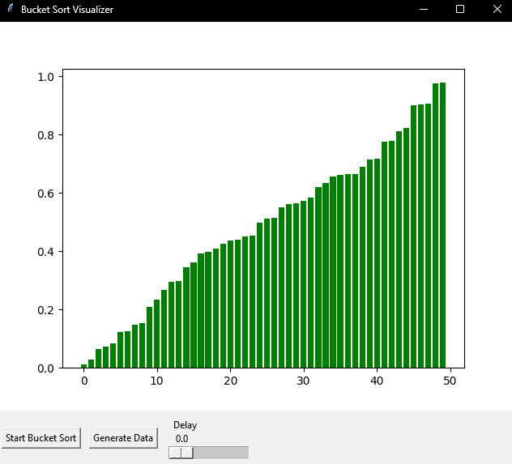

# Bucket Sort Algorithm

## Overview
BucketSort algorithm with real-time interface showing execution

## Prerequisites
- Python 3.x installed
- tkinter libraries

## Example
Data befored being sorted: 
 

Data after being sorted. 
 

<video width="320" height="240" controls>
  <source src="videos/Bucket Sort Visualizer.mp4" type="video/mp4">
  Seu navegador não suporta o elemento de vídeo.
</video>